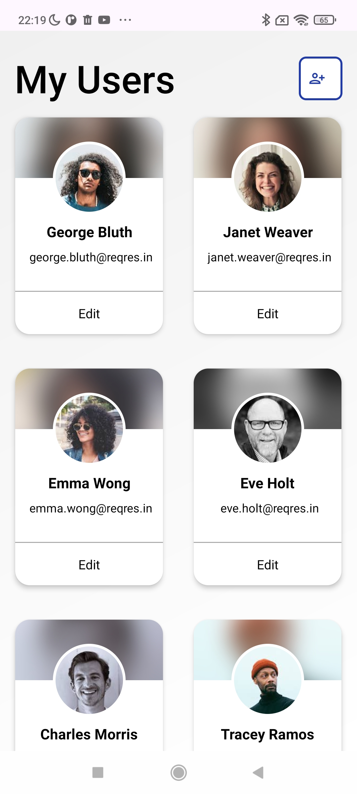
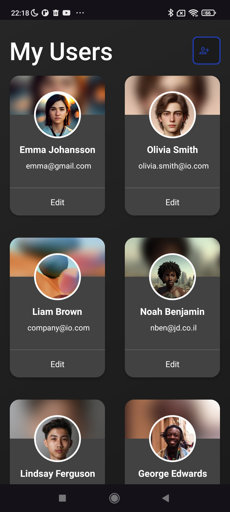
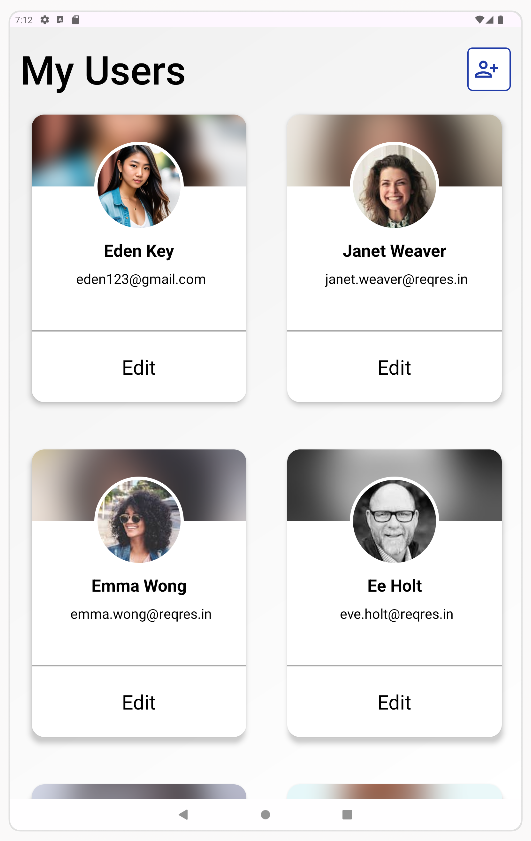

# User Management CRUD App 

The **User Management CRUD App** is an Android application designed to efficiently manage user data, providing a complete suite of functionalities for creating, reading, updating, and deleting (CRUD) users. 

The app leverages modern Android development practices and technologies to deliver a responsive and intuitive user experience, adaptable to various devices including phones and tablets.

## Navigation Bar
- [**Features**](#features)
- [**Technologies Used**](#technologies-used)
- [**Screenshots**](#screenshots)
- [**Usage**](#usage)

## Features

- **User Management**: Add, view, update, and delete users with attributes such as first name, last name, email, and avatar.

- **Pagination for Performance**: Loads user data in pages to enhance performance and improve the user experience, especially when dealing with a large number of users.

- **Dynamic Image Handling**: Allows users to select and update profile images from the device gallery, with paths stored in internal storage for efficient access.

- **Dark Mode Support**: Automatically adapts the UI for dark mode, improving usability in low-light environments.

- **Responsive Design**: Implements responsive layouts and resource qualifiers to provide an optimal experience on both phones and tablets.

- **Error Handling**: Effectively manages network errors and other exceptions, providing clear feedback to users.

## Technologies Used

- Java
- MVVM Architecture
- Pagination
- Executors
- Data Binding
- LiveData / MutableLiveData
- Retrofit
- Room Database
- GSON
- GSON Convertor
- SharedPreferences
- Internal Storage
- Implicit Intent
- Picasso
- Callbacks
- RecyclerView
- Responsive UI(Resource Qualifier)

## Screenshots

### Phones:

|  |  | 
|:--------------------------------------------:|:-------------------------------------------:|

### Tablet:

## Usage

### Prerequisites

1. **No API Key Required**: The app uses the open-source API provided by [Reqres](https://reqres.in/), so no API key is needed.

### Running the App

1. **Clone the Repository**: Download or clone the repository to your local machine.
2. **Open in Android Studio**: Import the project into Android Studio.
3. **Connect an Emulator or Device**: Make sure your emulator or device is connected and recognized by Android Studio.
4. **Run the App**: Click the "Run" button in Android Studio to build and launch the app.
5. **Enjoy Managing Users**: Add, view, update, or delete users, and manage their profile images from the gallery!

---

### Thank You for Checking Out the User Management CRUD App! 

